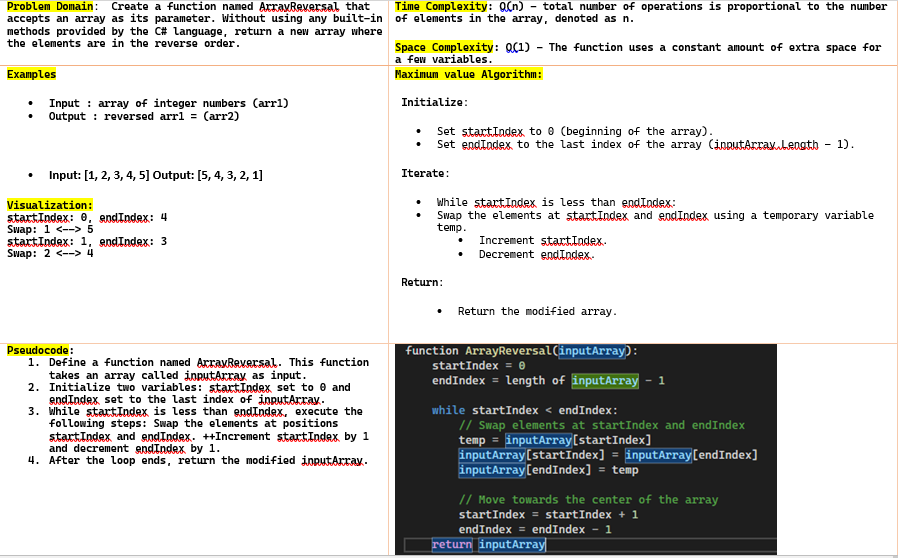
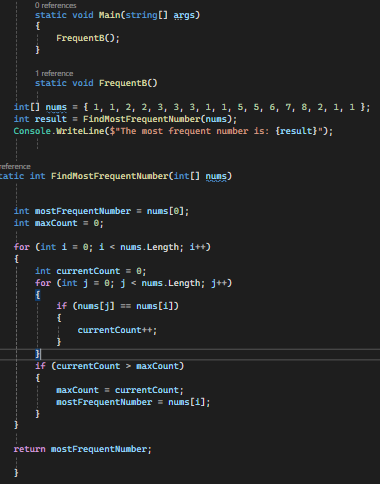
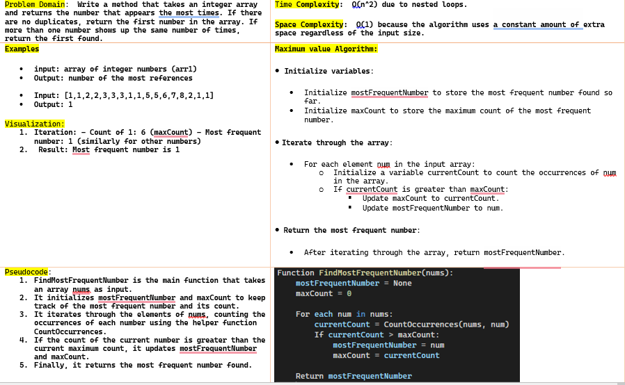
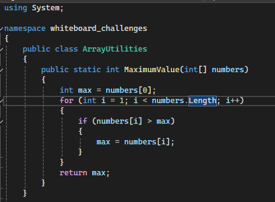
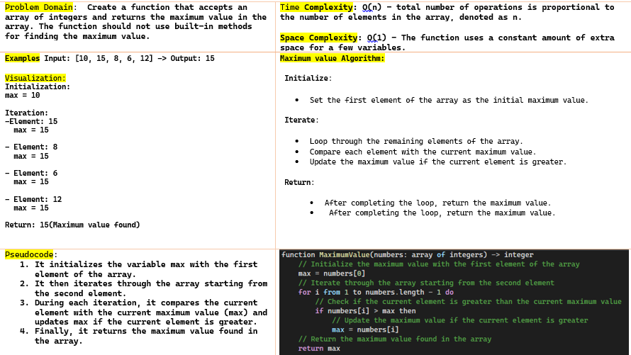

# whiteboard-challenges

## Challenge 01:
#### Challenge A: Array Reversal
	
[link](https://github.com/nooralbonne/challenges-and-data-structures/blob/master/Array-Reversal-code.png)	

#### Challenge B: Most Frequent Number
	

## Challenge 02: Maximum Value
	

