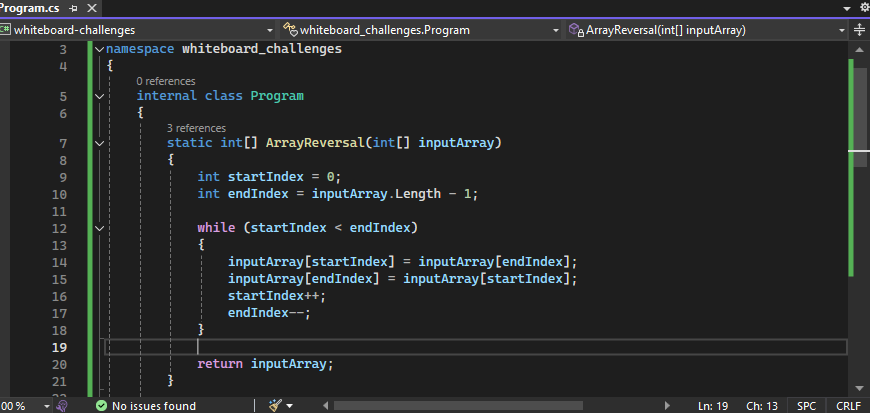
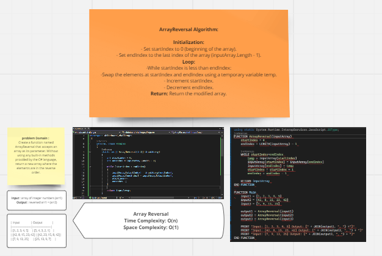
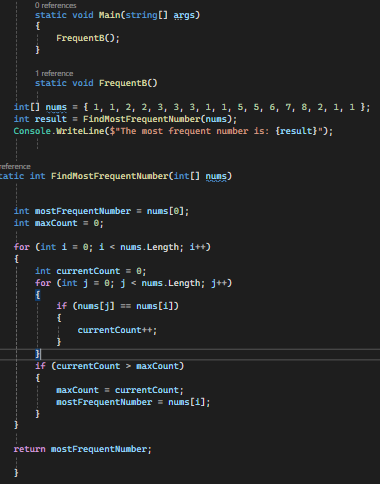
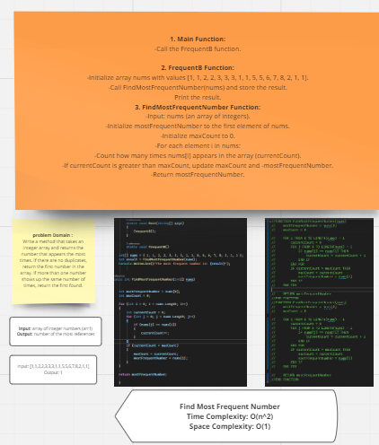

# whiteboard-challenges

### Whiteboard Images

### Challenge A: Array Reversal

Reverse an array without using built-in methods in C#.

### Challenge B: Most Frequent Number

Find the number that appears the most times in an array, returning the first number if there are no duplicates or the first found in case of a tie.
